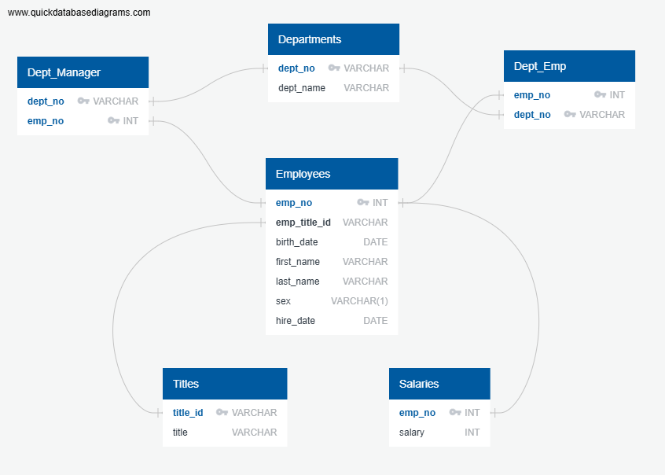

# employee-database
SQL Database Engineering - Data Analytics Course Module 9

# Task
I will be completing a research project about employees of a fictional company hired during the 1980s and 90s. Using six CSV files, I'll design corresponding tables, import those files into a SQL database and perform a series of queries on this new database. This task will require data modeling, data engineering and data analysis.

# Methodology 
## Data Modeling
Using the CSV files, I sketched an Entity Relationship Diagram in QuickDBD. Using headers and columns from the CSV files I created physical diagrams of Departments, Department Employees, Department Managers, Employees, Salaries, and Titles. For the Departments, Employees, Titles and Salaries tables, I identified one primary key. However, for Dept_Manager and Dept_Emp, I created a composite key because both values (dept_no and emp_no) were unique and could function as primary keys. The cardinality of each of these relationships was simply a one-to-one relationship because each record had one unique corresponding value. For example, the emp_no could only ever indicate that unique employee across different tables. The same can be said for dept_no and title_id. Determining primary and foreign keys was something of a challenge but a Tutor helped me to make corrections to my ERD sketch. I was initially missing the composite keys.

()

## Data Engineering
Using the ERD sketch for references, I created a table schema for each of the six CSV files, specifying data types, primary and foreign keys. When loading the CSV files into its corresponding SQL table, I encountered errors because some Employee numbers were missing. This issue was resolved when I changed the order in which I loaded the CSVs into the tables. This order loaded without errors: Titles, Employees, Departments, Dept_Emp, Dept_Manager, Salaries.

I created various versions of the employee_schema SQL files. Version 2 includes the Foreign Key constraints in the CREATE TABLE commands; however, it is missing the composite keys. Version 4 uses ALTER TABLE to add the Foreign Key constraints and also includes more correct Primary, Foreign and Composite Keys.

## Data Analysis
There are eight analysis tasks in this research task. I created queries for the following:
1. _List the employee number, last name, first name, sex, and salary of each employee._ This required a JOIN between the Employees and Salaries tables. A tutor pointed out that it should technically be a LEFT JOIN; however, a simple JOIN returns the same information, perhaps due to there only being two columns in Salaries.
3. _List the first name, last name, and hire date for the employees who were hired in 1986._ I used BETWEEN and AND operators to include all dates in 986.
4. _List the manager of each department along with their department number, department name, employee number, last name, and first name._ This required an INNER JOIN between first Dept_Manager and Departments and another between by Dept_Manager and Employees.
5. _List the department number for each employee along with that employee’s employee number, last name, first name, and department name._ This required an INNER JOIN between first Dept_Emp and Employees and another between by Dept_Emp and Departments. 
6. _List first name, last name, and sex of each employee whose first name is Hercules and whose last name begins with the letter B._ I used a WHERE clause to return all first names that were 'Hercules' and a LIKE wild card operator to return all last names that started with the letter B.
7. _List each employee in the Sales department, including their employee number, last name, and first name._  I wrote an initial query that successfully returned the required information but some additional data as well (dept_no). I used dept_no to identify all Sales department employees. A tutor helped me to write an alternative that returned only required information. This query used 'Sales' in the WHERE clause and joined table columns in a different order.
8. _List each employee in the Sales and Development departments, including their employee number, last name, first name, and department name._ I wrote a similar query to #7 but added an OR operator to find employees in both the Sales and Development departments.
9. _List the frequency counts, in descending order, of all the employee last names (that is, how many employees share each last name)._ I unsure about how to get a frequency count so I used Xpert Learning Assistant to construct the SELECT and COUNT commands. The GROUP BY clause aggregates the data by grouping each unique name and allowing the COUNT (*) function to tally how many times each last name appears in the Employees table.

# Conclusion

I took the additional step of creating new CSV files for each query. The results of these queries could be used for further analysis of particular trends. One could start to ask questions like: What were demographics of employees hired in 1986? What are average salaries per department? What are average manager salaries compared to other employee salaries? What were hiring date trends? Why is Hercules such a popular name?
